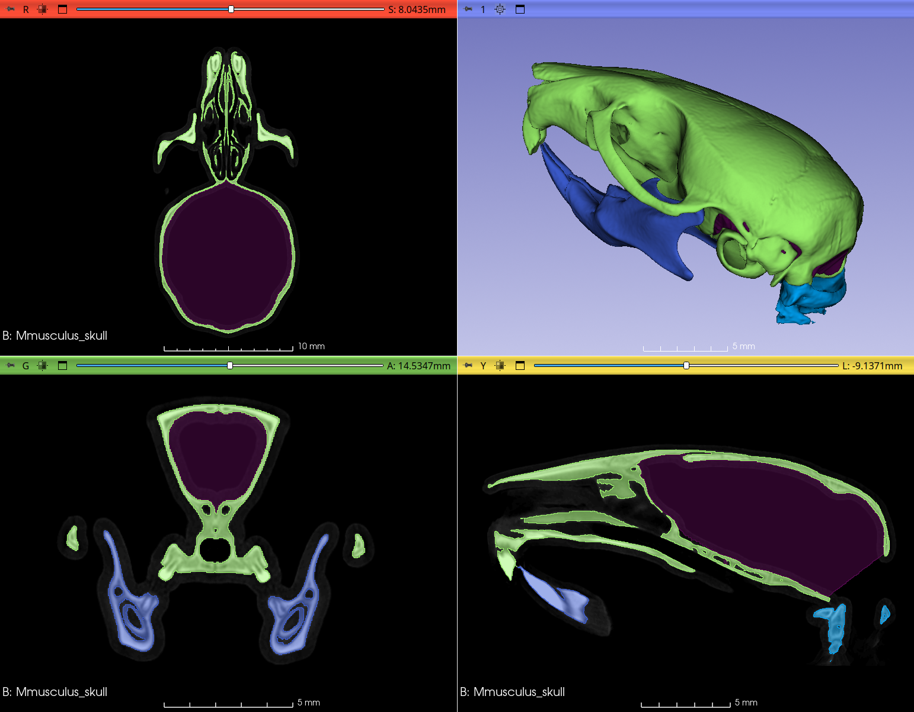

## MorphoDepot Repository
Repository for segmentation of a specimen scan.  See [this JSON file](MorphoDepotAccession.json) for specimen details.
* Species: Mus musculus
* Modality: Micro CT (or synchrotron)
* Contrast: No
* Dimensions: (520, 824, 456)
* Spacing (mm): (0.03527835011482239, 0.03527835011482239, 0.03527835011482239)

## Screenshots

## Additional Information
### About scan and the specimen

This is an average mouse skull generated through [ANTsPy template generation workflow](https://github.com/SlicerMorph/SlicerANTsPy) using a representative individual from 25 inbred and five F1 strains of commercially acquired laboratory mice. Original data was acquired at 18 micron, resampled to 35 micron for template building purposes. Segmentation was generated by Dr. Murat Maga (UW). Original specimens were collected in accordance with IACUC protocol 13733 (SCRI). More information about the strains used and template generation can be found in the citation below. 

### Citation
If you use this dataset, please cite **Maga AM, Tustison NJ, Avants BB (2017) A population level atlas of Mus musculus craniofacial skeleton and automated image-based shape analysis. Journal of Anatomy, 231(3):433–443. https://doi.org/10.1111/joa.12645**

### Funding 
These data were generated through funding from National Institutes of Health (R03DE027110,  Inbred Mice Strains: Untapped Resource For Genome-Wide Quantitative Association Study For Craniofacial Shape ) 
